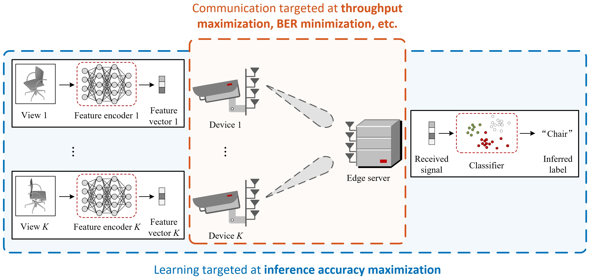
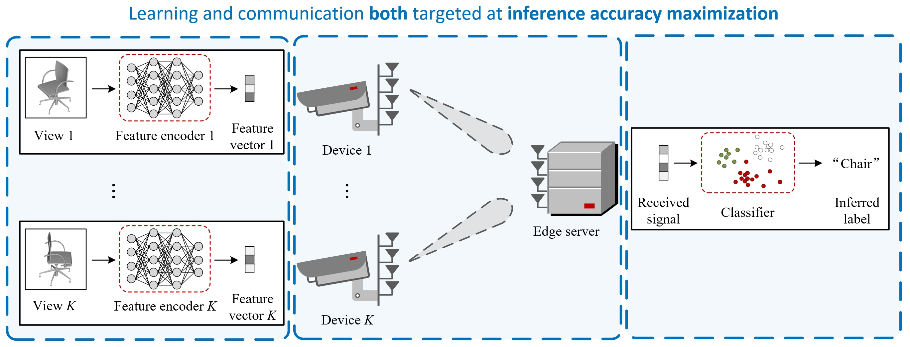

# TaskCommMCR2

This repository is the official implementation of the paper:

- **Multi-Device Task-Oriented Communication via Maximal Coding Rate Reduction** [[IEEE TWC](https://ieeexplore.ieee.org/abstract/document/10689268)] [[arXiv](https://arxiv.org/abs/2309.02888)]
- **Authors:** [Chang Cai](https://chang-cai.github.io/) (The Chinese University of Hong Kong), [Xiaojun Yuan](https://scholar.google.com/citations?user=o6W_m00AAAAJ&hl=en) (University of Electronic Science and Technology of China), and [Ying-Jun Angela Zhang](https://staff.ie.cuhk.edu.hk/~yjzhang/) (The Chinese University of Hong Kong)

## Brief Introduction

### Existing Studies: Inconsistent Objectives for Learning and Communication

<p align="center">
    
</p>

### This Work: Synergistic Alignment of Learning and Communication Objectives

<p align="center">
    
</p>


## Usage

### Feature Encoding
- Download images and put it under ```modelnet40_images_new_12x```: [Shaded Images (1.6GB)](http://supermoe.cs.umass.edu/shape_recog/shaded_images.tar.gz).

- Set environment: code is tested on ```python 3.7.13``` and ```pytorch 1.12.1```.

- Run the script ```main_train_phase1.py``` for the first-phase training of feature encoding.
Then, run the script ```main_train_phase2.py``` for the second-phase training of feature encoding. Check [mvcnn_pytorch](https://github.com/jongchyisu/mvcnn_pytorch) for the details of the two training phases.

- Alternatively, download the pretrained checkpoints at [Google Drive](https://drive.google.com/drive/folders/1bi2kMot2XI3H27MitiCE6ecxATnGIn5r?usp=drive_link). The checkpoints can be used for feature extraction by running the script ```feature_load.py```.

### Precoding Optimization and Performance Evaluation

The code is located at the folder ```precoding_opt_matlab```.
Run the script ```main_precoding_opt.m``` to compare the performance of the proposed MCR<sup>2</sup> precoder and the LMMSE precoder.

## Citation
If you find our work interesting, please consider citing

```
@ARTICLE{task_comm_mcr2,
  author={Cai, Chang and Yuan, Xiaojun and Zhang, Ying-Jun Angela},
  journal={IEEE Transactions on Wireless Communications}, 
  title={Multi-Device Task-Oriented Communication via Maximal Coding Rate Reduction}, 
  year={2024},
  volume={23},
  number={12},
  pages={18096-18110}
  }
```
[Our follow-up work](https://ieeexplore.ieee.org/abstract/document/10845817) provides an information-theoretic interpretation of the learning-communication separation, as well as an end-to-end learning framework:

```
@ARTICLE{info_theoretic_e2e,
  author={Cai, Chang and Yuan, Xiaojun and Zhang, Ying-Jun Angela},
  journal={IEEE Journal on Selected Areas in Communications}, 
  title={End-to-End Learning for Task-Oriented Semantic Communications Over {MIMO} Channels: An Information-Theoretic Framework}, 
  year={2025},
  volume={},
  number={},
  pages={1-16}
  }
```