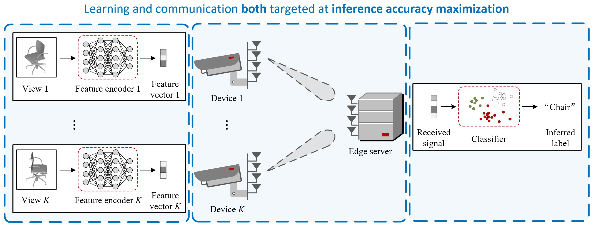

# TaskCommMCR2
This repository is the official implementation of the paper:

- **Multi-Device Task-Oriented Communication via Maximal Coding Rate Reduction** [[paper link](https://arxiv.org/abs/2309.02888)]
- **Authors:** [Chang Cai](https://chang-cai.github.io/) (The Chinese University of Hong Kong), [Xiaojun Yuan](https://scholar.google.com/citations?user=o6W_m00AAAAJ&hl=en) (University of Electronic Science and Technology of China), and [Ying-Jun Angela Zhang](https://staff.ie.cuhk.edu.hk/~yjzhang/) (The Chinese University of Hong Kong)

## Background and Motivation

### Existing Studies: Inconsistent Objectives for Learning and Communication

    

In most of the existing studies on task-oriented communications, the physical-layer design criteria are still throughput maximization, delay minimization, or bit error rate (BER) minimization as in conventional communications, which are not aligned with the design objective of the learning module targeted at accurate execution of specific tasks.
**The inconsistency between learning and communication objectives may hinder the exploitation of the full benefits of task-oriented communications.**

### This Work: Synergistic Alignment of Learning and Communication Objectives

    

End-to-end (E2E) learning can be a potential candidate to achieve a consistent design objective for learning and communication targeted at the successful completion of the task.
However, it is typically unaffordable to train such an E2E network adaptive to varying wireless environments, especially for multi-antenna transceivers that result in a high-dimensional channel matrix.
This is because the E2E network needs to learn the parameters based on both the task dataset and the entire distribution of wireless channels, incurring a prohibitively large training overhead and unpredictable training complexity.

**In view of the above, we advocate the separation of learning task (i.e., feature encoding and classification) and communication design (i.e., precoding optimization), while maintaining a consistent design objective for both modules targeted at inference accuracy maximization.**

## Why MCR2?

**Challenge:** The inference accuracy can only be empirically evaluated over all the testing samples.
It has no explicit expression as a function of the precoders and is thus hard to optimize directly.

**Solution:** It is critical to explicitly characterize the inference accuracy based on the intermediate features instead of relying on the classifier’s output.
More precisely, we need to formulate a measure on the separability of the different classes of features as a surrogate of the inference accuracy.
This characterization/measure can be applied to measure the accuracy based on the received features, which is an explicit function of the precoders amenable to optimization.

This work invokes the principle of maximal coding rate reduction (MCR2) as a measure of inference accuracy for both feature encoding and precoding optimization design.
It endeavors to expand the space spanned by the overall features and, in the meanwhile, to compress the subspace spanned by each individual class, so that different classes are maximally separated.
