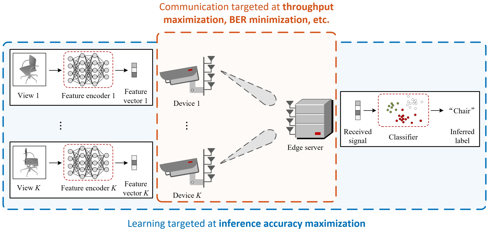

# TaskCommMCR2
This repository is the official implementation of the paper:

- **Multi-Device Task-Oriented Communication via Maximal Coding Rate Reduction** [[paper link](https://arxiv.org/abs/2309.02888)]
- **Authors:** [Chang Cai](https://chang-cai.github.io/) (The Chinese University of Hong Kong), [Xiaojun Yuan](https://scholar.google.com/citations?user=o6W_m00AAAAJ&hl=en) (University of Electronic Science and Technology of China), and [Ying-Jun Angela Zhang](https://staff.ie.cuhk.edu.hk/~yjzhang/) (The Chinese University of Hong Kong)

## Background

### Existing Studies: Inconsistent Objectives for Learning and Communication

    

### This Work: Synergistic Alignment of Learning and Communication Objectives
